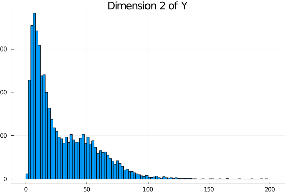

# Introduction

This document contains the data generation process for the dataset accompanying 
the `LRMoE.jl` package (see [here](https://github.com/sparktseung/LRMoE-jl-demo)).
This also serves as an example of using the `sim_dataset` function 
included in the package.

# Data Simulation

## Complete Data
Suppose there is an auto-insurance company with two lines of business, with a total of 10,000 policies. 
The policyholder information includes sex (1 for Male and 0 for Female), driver's age (with range 20 - 80), 
car age (with range 0 - 10), and region (1 for urban and 0 for rural). 
We assume all covariates are uniformly and independently drawn at random.

```julia
# Random seed for reproducible results
Random.seed!(7777)
sample_size = 10000

intercept = fill(1.0, sample_size)
sex = rand(Binomial(1, 0.50), sample_size)
aged = rand(Uniform(20, 80), sample_size)
agec = rand(Uniform(0, 10), sample_size)
region = rand(Binomial(1, 0.50), sample_size)

X = DataFrame(intercept = intercept, sex= sex, 
              aged = aged, agec = agec, region = region)
```


The first few rows of `X` are shown below.

```
5×5 DataFrame
 Row │ intercept  sex    aged     agec     region
     │ Float64    Int64  Float64  Float64  Int64
─────┼────────────────────────────────────────────
   1 │       1.0      1  56.4367  3.3857        1
   2 │       1.0      1  29.7025  2.31892       1
   3 │       1.0      1  33.4796  8.61125       0
   4 │       1.0      0  38.7478  2.88865       1
   5 │       1.0      1  47.348   9.01135       0
```


For simplicity, we assume there are two latent risk classes: low (L) and high (H). 
The characteristics for the high-risk class are male, young age, old car age and urban region. 
This is specified by the following matrix of logit regression coefficients, 
where the second row represents the reference class.

```julia
α = [-0.5 1.0 -0.05 0.1 1.25;
      0.0 0.0   0.0 0.0  0.0]
```


We consider a two-dimensional response: claim frequency from the first business line, 
and claim severity from the second business line. 
For demonstration purposes and for simplicity, we don't consider the same business line to avoid the complication 
where zero frequency necessarily implies zero severity. 
The component distributions and their parameters are specified as follows.

```julia
comp_dist = [PoissonExpert(6.0)         ZIGammaCountExpert(0.20, 30, 0.50);
             LogNormalExpert(4.0, 0.3)  InverseGaussianExpert(20, 20)]
```


The `LRMoE.jl` package includes a simulator. Given the covariates and parameters defined above, 
we can directly simulate a dataset.

```julia
Y_complete = LRMoE.sim_dataset(α, X, comp_dist)
```


The simulated values are plotted as follows. 
For each dimension of `Y`, the histogram is relatively well separated as two components. 
This is more or less done on purpose to demonstrate that the fitting procedure can identify the *true* model 
when it is known. 
In practice, we are usually less concerned of the underlying data generating distribution, 
as long as the LRMoE model provides a reasonable fit of data.





## Truncation and Censoring

One distinct feature of `LRMoE` is dealing with data truncation and censoring, 
which is common in insurance contexts.
 Consequently, instead of one single number for each dimension `d`, a tuple `(tl_d, yl_d, yu_d, tu_d)` is required, 
 where `tl_d`/`tu_d` are the lower/upper bounds of truncation, and `yl_d`/`yu_d` are the lower/upper bounds of censoring.

For illustration purposes, we assume the dataset is subject to the following truncation and censoring.

| Index      	| `Y_complete[:,1]`             | `Y_complete[:,2]`            	|
|------------	|-----------------------------	|-----------------------------	|
| 1-6000     	| No truncation  or censoring 	| No truncation  or censoring 	|
| 6001-8000  	| No truncation  or censoring 	| Left Truncated at 5         	|
| 8001-10000 	| No truncation  or censoring  	| Right Censored at 100  	      |

```julia
# First block: 1~6000
X_obs = X[1:6000,:]

tl_1 = fill(0.0, 6000)
yl_1 = Y_complete[1:6000, 1]
yu_1 = Y_complete[1:6000, 1]
tu_1 = fill(Inf, 6000) 

tl_2 = fill(0.0, 6000)
yl_2 = Y_complete[1:6000, 2]
yu_2 = Y_complete[1:6000, 2]
tu_2 = fill(Inf, 6000) 

# Second block: 6001~8000
keep_idx = Y_complete[6001:8000,2] .>=  5
keep_length = sum(keep_idx) # 1837 out of 2000

append!(X_obs, X[6001:8000,:][keep_idx,:])

append!(tl_1, fill(0.0, keep_length))
append!(yl_1, Y_complete[6001:8000, 1][keep_idx])
append!(yu_1, Y_complete[6001:8000, 1][keep_idx])
append!(tu_1, fill(Inf, keep_length))

y_temp = Y_complete[6001:8000, 2][keep_idx]
append!(tl_2, fill(5.0, keep_length))
append!(yl_2, Y_complete[6001:8000, 2][keep_idx])
append!(yu_2, Y_complete[6001:8000, 2][keep_idx])
append!(tu_2, fill(Inf, keep_length))

# Third block: 8001~10000
append!(X_obs, X[8001:10000,:])

append!(tl_1, fill(0.0, 2000))
append!(yl_1, Y_complete[8001:10000, 1])
append!(yu_1, Y_complete[8001:10000, 1])
append!(tu_1, fill(Inf, 2000))

y_temp = Y_complete[8001:10000, 2]
censor_idx = y_temp .>= 100.0 # 21 out of 2000
yl_temp = copy(y_temp)
yl_temp[censor_idx] .= 100
yu_temp = copy(y_temp)
yu_temp[censor_idx] .= Inf
append!(tl_2, fill(0.0, 2000))
append!(yl_2, yl_temp)
append!(yu_2, yu_temp)
append!(tu_2, fill(Inf, 2000))

# Put things together
Y_obs = DataFrame(tl_1 = tl_1, yl_1 = yl_1, yu_1 = yu_1, tu_1 = tu_1,
                  tl_2 = tl_2, yl_2 = yl_2, yu_2 = yu_2, tu_2 = tu_2)
```


As a result of truncating `Y_complete[:,2]`, 163 rows are discarded, 
leaving 9837 observations available for model fitting. Sample data points are show below.

```
3×4 DataFrame
 Row │ tl_1     yl_1     yu_1     tu_1
     │ Float64  Float64  Float64  Float64
─────┼────────────────────────────────────
   1 │     0.0      6.0      6.0     Inf
   2 │     0.0      8.0      8.0     Inf
   3 │     0.0      7.0      7.0     Inf
```


```
3×4 DataFrame
 Row │ tl_2     yl_2      yu_2      tu_2
     │ Float64  Float64   Float64   Float64
─────┼──────────────────────────────────────
   1 │     0.0   89.0332   89.0332     Inf
   2 │     5.0   37.4133   37.4133     Inf
   3 │     0.0  100.0     Inf          Inf
```


We will export both the complete and incomplete datasets to the `LRMoE.jl` package.
```julia
@save "X_complete.jld2" X
@save "Y_complete.jld2" Y_complete
@save "X_obs.jld2" X_obs
@save "Y_obs.jld2" Y_obs
```
