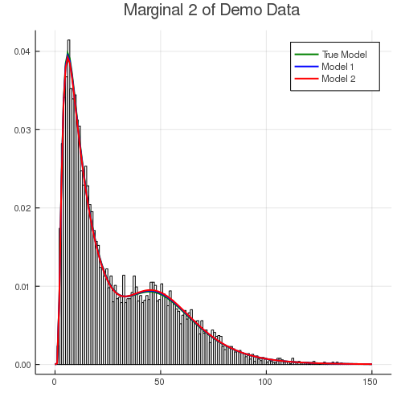

# Introduction

This document contains the data fitting process for the demo dataset included in the `LRMoE.jl` package. 
This serves as an example of using the main fitting function `fit_LRMoE` included in the package.

```julia
# Load data
@load "X_obs.jld2" X_obs
@load "Y_obs.jld2" Y_obs
```


# Fitting `LRMoE`

In this section, we demonstrate how to fit an LRMoE model in the package. 
In the current version of `LRMoE`, the minimal inputs required from the user are: 
response, covariates, initialization of logit regression coeffecients and
component distributions.

```julia
# Assume a non-informative guess
α_guess = fill(0.0, 2, 5)
# Correctly specified component distributions
model_guess = [PoissonExpert(10.0) ZIGammaCountExpert(0.50, 40, 0.80);
               LogNormalExpert(3.0, 1.0) InverseGaussianExpert(15.0, 15.0)]
```


Now we are ready to call the fitting function.
It is optional to print out intermediate updates of parameters. 

```julia
result_1 = fit_LRMoE(Y_obs, X_obs, α_guess, model_guess)
```


The fitted model can be viewed as follows.
```julia
summary(result_1)
```

```
Model: LRMoE
Fitting converged after 7 iterations
Dimension of response: 2
Number of components: 2
Loglik: -73153.32112999677
Loglik (no penalty): -73147.35233984645
AIC: 146320.7046796929
BIC: 146414.22545854456
Fitted α:
[-0.4317549468937167 1.0687536487401863 -0.0501666562042898 0.0951104899516
9831 1.1966666208577514; 0.0 0.0 0.0 0.0 0.0]
Fitted component distributions:
AnyExpert{LRMoE.NonNegative,z,d} where d<:(Distribution{Univariate,S} where
 S<:ValueSupport) where z<:ZeroInflation[PoissonExpert{Float64}(6.016755579
291526) ZIGammaCountExpert{Float64}(0.2061960764035149, 29.956369104025327,
 0.4888535921075801); LogNormalExpert{Float64}(4.001049211038016, 0.2967339
201031063) InverseGaussianExpert{Float64}(20.303659308753492, 21.7568654316
48063)]
```


More specifically, the fitted logit regression coefficients and component distributions are
given below. We see that the fitting function can correctly identify the true model within
reasonable range.

```julia
result_1.model_fit.α
```

```
2×5 Array{Float64,2}:
 -0.431755  1.06875  -0.0501667  0.0951105  1.19667
  0.0       0.0       0.0        0.0        0.0
```


```julia
result_1.model_fit.comp_dist
```

```
2×2 Array{AnyExpert{LRMoE.NonNegative,z,d} where d<:(Distribution{Univariat
e,S} where S<:ValueSupport) where z<:ZeroInflation,2}:
 PoissonExpert{Float64}(6.01676)              …  ZIGammaCountExpert{Float64
}(0.206196, 29.9564, 0.488854)
 LogNormalExpert{Float64}(4.00105, 0.296734)     InverseGaussianExpert{Floa
t64}(20.3037, 21.7569)
```


In practice, it is almost impossible to know the *true* underlying distribution of data. 
Assume the user has conducted some preliminary analysis, and proposes to use the following LRMoE.

```julia
# Assume a non-informative guess
α_guess = fill(0.0, 2, 5)
# Incorrectly specified component distributions
model_guess = [ZIPoissonExpert(0.50, 10.0) ZIPoissonExpert(0.50, 20.0);
               BurrExpert(5.0, 2.0, 30.0) GammaExpert(1.0, 10.0)]
```


We call the fitting function similarly as before.
```julia
result_2 = fit_LRMoE(Y_obs, X_obs, α_guess, model_guess, penalty=true)
```


```julia
summary(result_2)
```

```
Model: LRMoE
Fitting converged after 29 iterations
Dimension of response: 2
Number of components: 2
Loglik: -74522.97988044818
Loglik (no penalty): -74491.23826492707
AIC: 149010.47652985415
BIC: 149111.19121477133
Fitted α:
[-0.402329688892696 1.0642517348023806 -0.04993352290476096 0.0955025073281
0937 1.1787815897308458; 0.0 0.0 0.0 0.0 0.0]
Fitted component distributions:
AnyExpert{LRMoE.NonNegative,z,d} where d<:(Distribution{Univariate,S} where
 S<:ValueSupport) where z<:ZeroInflation[ZIPoissonExpert{Float64}(0.0032705
87671859084, 6.1027631872596455) ZIPoissonExpert{Float64}(0.206265076006209
33, 30.584982151431703); BurrExpert{Float64}(1.3092510512796607, 5.23197932
44529444, 58.7993745083068) GammaExpert{Float64}(1.6243105423038051, 12.398
187227236122)]
```


# Fitted Results

We can visually examine the fitted results of `result_1` and `result_2`.
The following histogram compares dimension 1 of the observed data (green) 
with fitted model 1 (blue) and model 2 (red). Since the true model has a slightly
heavy tail due to the gamma-count component, model 2 fails to capture this
characteristics with only two Poisson components.


The histogram below shows the fitting result for the second dimension (excluding
zero inflation). Both models fit the body of data quite well. This is partly because
both Burr and Inverse Gaussian distributions are dense (see [Fung et al. (2019)](https://www.sciencedirect.com/science/article/abs/pii/S0167668719303956)). 
In other words, they are flexible enough to
capture the distribution of response, even under a mis-specified model.




The fitting results can also be demonstrated with the following Q-Q plots.
For both dimensions of the response, the mis-specified model 2 gives a
slightly worse fit for the tails.


